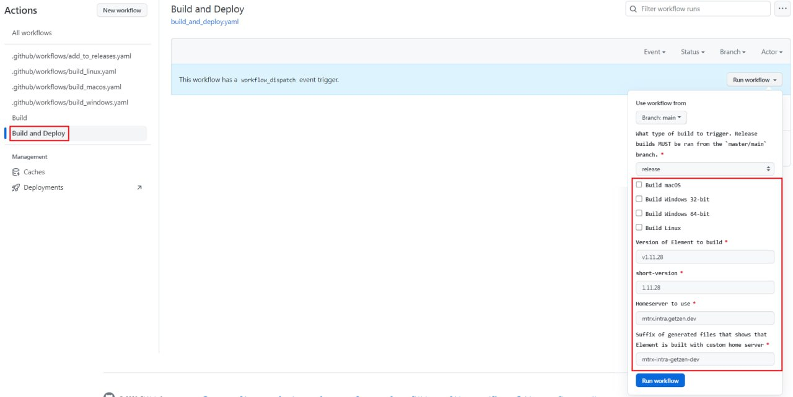

# chs-element-desktop

Build [Element Desktop](https://github.com/vector-im/element-desktop) with custom home server.

## How to use

1. Fork this repository
2. Choose workflow "Build and deploy" in actions (like at image)
3. Select operating systems that you need, specify version of element that you need and name of server that you want to use like your homeserver
4. Short version should be the same as version without "v" - preffix (like at image)
5. Suffix of generated files will be used only for the names of outputs installers